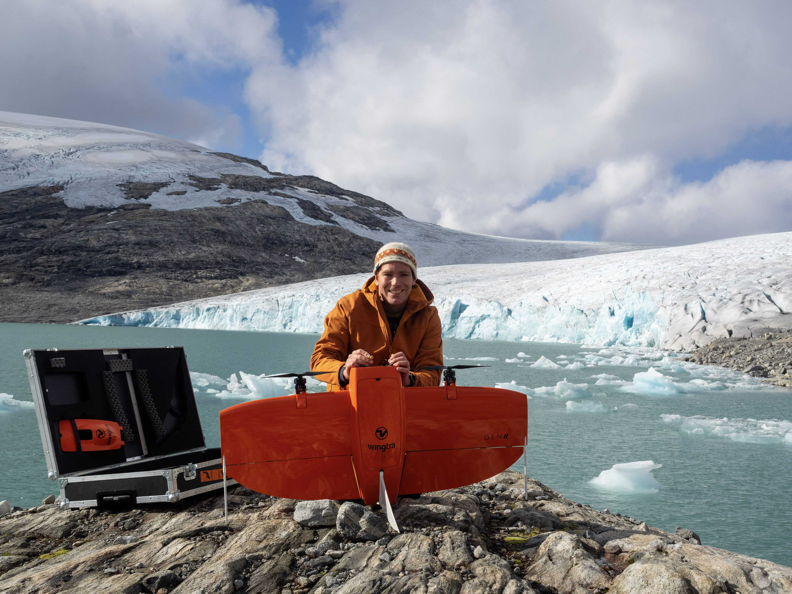
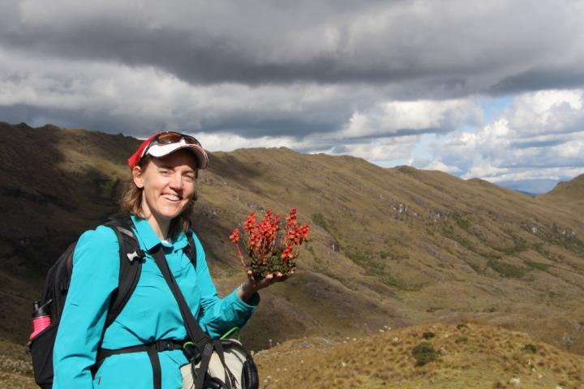
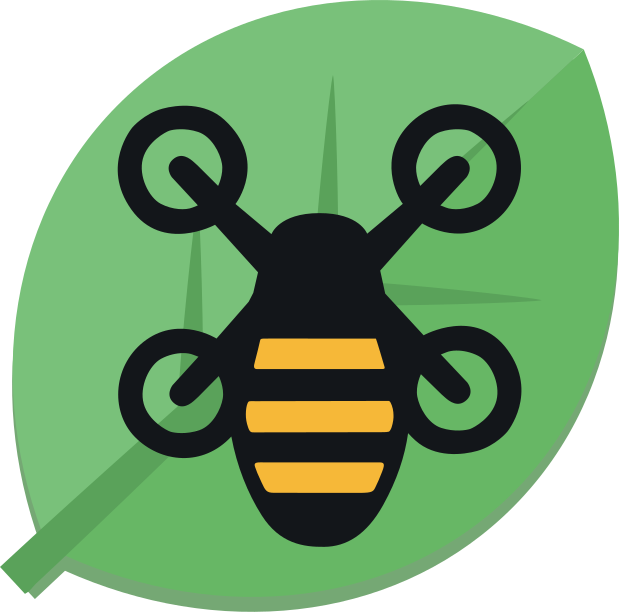

```{=html}
<style>
.team-grid img:not(.no-crop) {
  width: 160px;
  height: 140px;
  object-fit: cover;
  object-position: center top;
}
</style>
```

:::{.column-page}
:::{.team-grid}
::: {.grid}

::: {.g-col-6}
::: {.grid}
::: {.g-col-4}

:::
::: {.g-col-8}
## Ørjan Totland
Ørjan Totland is the willow and bumblebee expert!
:::
:::
:::

::: {.g-col-6}
::: {.grid}
::: {.g-col-4}

:::
::: {.g-col-8}
## Benjamin Aubrey Robson
Benjamin is the Drone expert!
:::
:::
:::

::: {.g-col-6}
::: {.grid}
::: {.g-col-4}

:::
::: {.g-col-8}
## Suzette Flantua
Suzette is an ecologist!
:::
:::
:::

::: {.g-col-6}
::: {.grid}
::: {.g-col-4}

:::
::: {.g-col-8}
## Many others!
A long list of contributers have helped make this project successfull. Including Augusto Lima, Raul Perez Prats, Julien Vadnais, Yiyao Chen, Daniel Thomas, Sjur Barndon, Savanna Nylund, Ingrid Haukereid, and Léonard Saint-Arnaud.
:::
:::
:::

::: {.g-col-6}
::: {.grid}
::: {.g-col-4}

:::
::: {.g-col-8}
## The Drone
This is the Wingtra Drone, equipped with a Light Detection and Ranging (LiDAR) sensor and a MicaScence Multispectral camera.
:::
:::
:::

::: {.g-col-6}
::: {.grid}
::: {.g-col-4}
{.no-crop}
:::
::: {.g-col-8}
## Contact
Get in touch with Suzette Flantua if you are interrested in learning more about the Drone-Willow-Bumblebee project:
[Send us an email](mailto:Suzette.Flantua@uib.no?subject=Willow%20Project)
:::
:::
:::

:::
:::
:::
