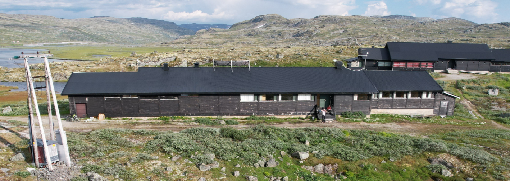
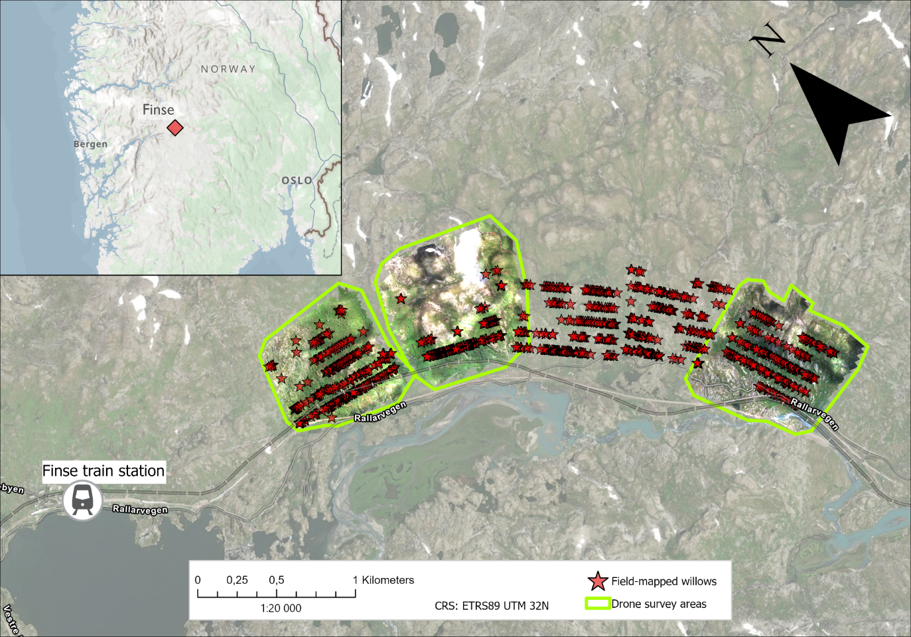
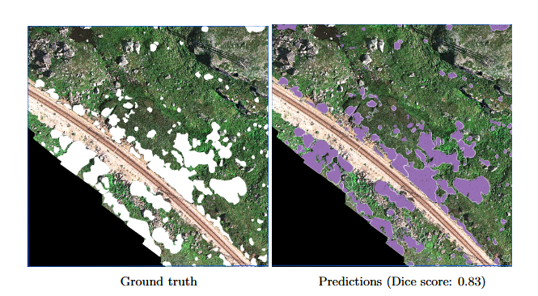
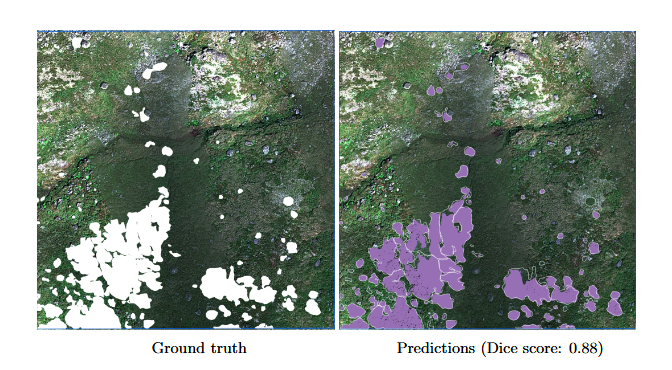
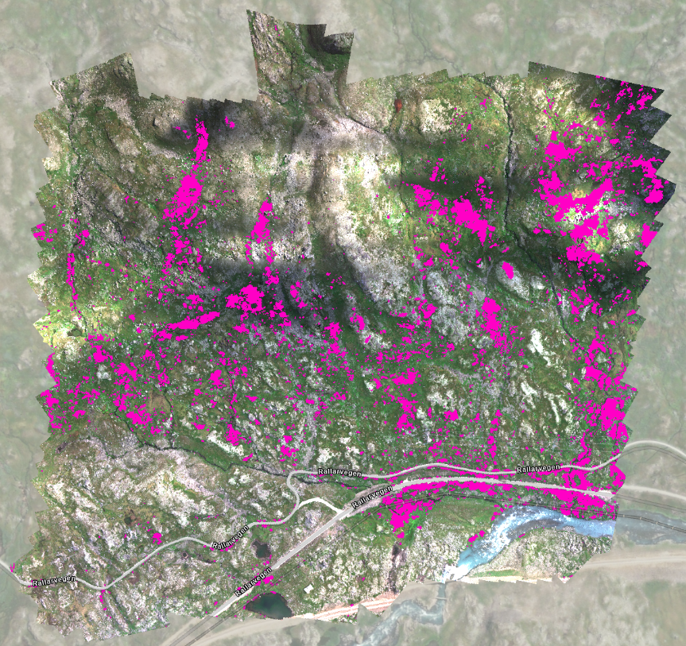

## Overview
Two species of willows populate the surroundings of Finse, Norway: *Salix lanata* and *Salix glauca*. They are thought to be important to pollinators, and it is unclear how their spatial extent has changed in the last decades due to climate change.

This report presents experimental method to map willow bushes in the Norwegian mountain plateau. The method is based on a deep learning model, high-resolution drone imagery, and [field sampling](willow-identification.qmd). Preliminary results show that the machine learning model can effectively delineate the willows in unseen images, thus demonstrating it could be used operationally on a larger scale.

## Study Area
The study area is made of five zones, chosen in relation to the M.Sc projects of Savanna and Ingrid. We conducted a series of field transects on 24–25 July 2025, using an ArcGIS FieldMaps project to geolocate willow bushes. Out of the five zones, three were covered by our drone survey, covering about 2 000 000 m².

## Model Results on the Test Areas
Here are visual representation of the results on two of the test areas, using the model which offered the best and most stable performance during validation. It is a DeepLabV3 model, using a ResNet-50 backbone as feature encoder, and using tiles of 786×786 pixels. Below (Fig. 4–5), we show the model's performance when predicting on unseen images. The ground truth images show willows as mapped manually, which was done with help of the field mapping.

::: {layout-ncol=1}

:::

::: {layout-ncol=1}

:::

## Running the Model on the Whole Finse Drone Survey
Here are preliminary results showing what we obtain from running the model on the whole study area — for illustrative purposes only!

