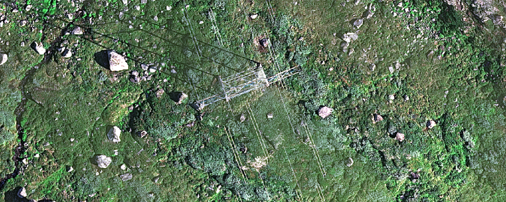
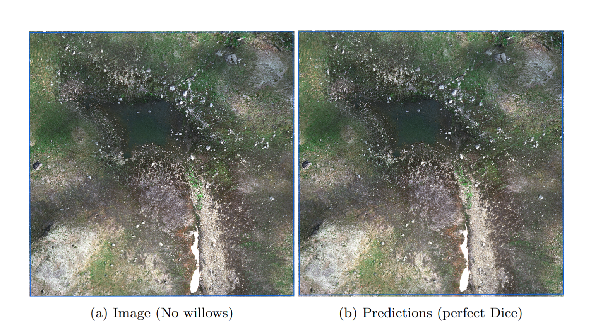
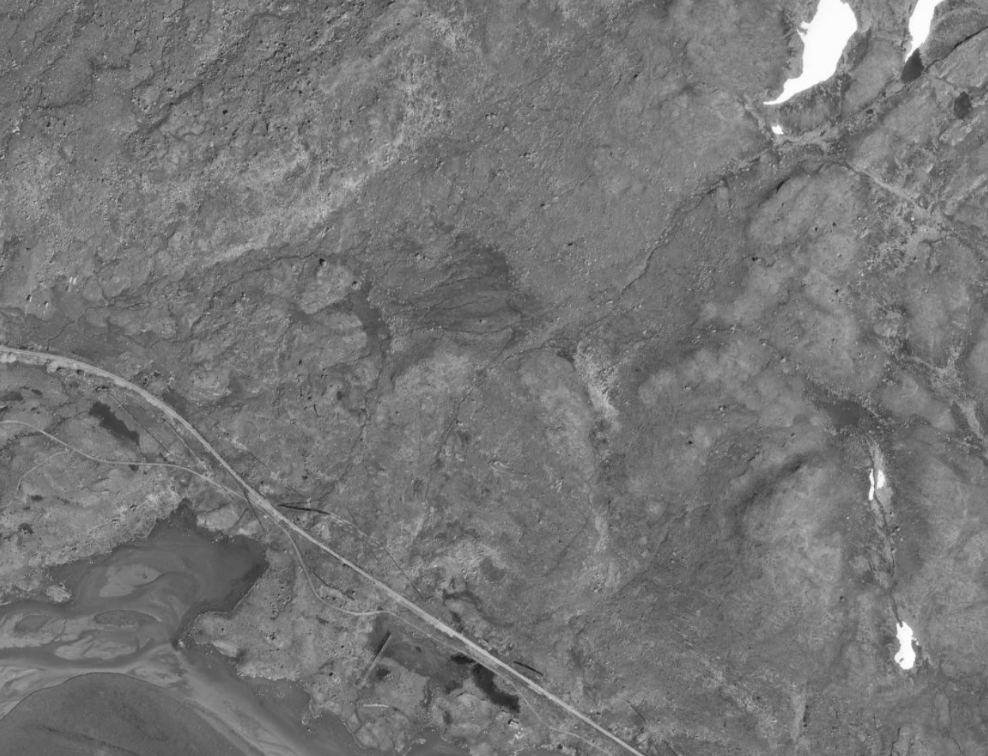

## Overview

Two species of willows populate the surroundings of Finse, Norway: *Salix lanata* and *Salix glauca*. They are thought to be important to pollinators, and it is unclear how their spatial extent has changed in the last decades due to climate change.

This report presents experimental results of an automatic method to map willow bushes in the Norwegian mountain plateau. The method is based on a deep learning model, high-resolution drone imagery, and field sampling. Results show that the resulting model can effectively delineate the willows in unseen images, thus demonstrating it could be used operationally on a larger scale.

## Study Area

The study area is made of five zones, chosen in relation to the M.Sc projects of Savanna and Ingrid. We conducted a series of field transects on 24–25 July 2025, using an ArcGIS FieldMaps project to geolocate willow bushes. Out of the five zones, three were covered by our drone survey, covering about 2 000 000 m².

## Drone Data

We used a Wingtra drone equipped with a MicaSense RE-P camera, which captures images in five spectral bands: blue, green, red, red edge, and near-infrared (NIR). The area flown over is mostly hilly and open, with aerial power lines as the only notable obstacle. Images were collected with a spatial resolution of 4 cm per pixel, and were preprocessed to reduce the effect of shadows and variations in contrast. Capturing fine spatial and spectral details is key for this automatic method to work; otherwise, the results would degrade significantly.

## Model Results on the Test Areas

We present visual results on three test areas, using the model which offered the best and most stable performance during validation. It is a DeepLabV3 model, using a ResNet-50 backbone as feature encoder, and using tiles of 786×786 pixels (Table 2). Below (Fig. 4–6), we show the model's performance when predicting on unseen images. The ground truth images show willows as mapped manually, which was done with help of the field mapping.

::: {layout-ncol=1}

:::

::: {layout-ncol=1}

:::

::: {layout-ncol=1}

:::

## Appendix

### Details About Data Preparation

Annotating the drone imagery for willows is time-consuming. To prepare a training dataset, we first delimited smaller zones for the training, validation, and testing phase. It is important that the testing area does not overlap with the areas in which images were seen during training. Identifying the willow bushes in the drone images is possible, particularly if the images were taken during the flowering stage of the willows. However, field sampling and geolocation of willow bushes made interpreting the images and creating the training data much easier.

### Details About the Deep Learning Model Workflow

We split the drone images in smaller tiles (512 and 786 pixels), using a tiling overlap of half the tile size, and keeping the optical (RGB) bands only. The deep learning models were implemented in ArcGIS Pro (DeepLabV3), and PyTorch (U-Net and Segformer). The backbones are initialized with weights from ImageNet pretraining. We used the default image augmentations implemented in ArcGIS: random rotations, flips, pixel shifts and croppings. Padding and overlap is used during test-time predictions. Models were trained by monitoring the default cross-entropy loss function on a 10% validation split.

Below, we show our comparison results for different models evaluated on the validation split. Models are compared using a tile size of 512 (Table 1) and 768 pixels (Table 2).

| Backbone | DeepLabV3 | U-Net | Segformer |
|---|---|---|---|
| ResNet-50 | 0.797 | 0.797 | / |
| ResNet-101 | 0.803 | 0.801 | / |
| DenseNet-121 | 0.734 | 0.791 | / |
| EfficientNet-b7 | / | 0.798 | / |
| MiT-b4 | / | / | 0.796 |
| MiT-b5 | / | / | 0.793 |

: 512×512 tiles: Model comparison (Dice score) on the validation split. {#tbl-512}

| Backbone | DeepLabV3 | U-Net | Segformer |
|---|---|---|---|
| ResNet-50 | 0.818 | 0.811 | / |
| ResNet-101 | 0.778 | 0.815 | / |
| DenseNet-121 | 0.732 | 0.771 | / |
| EfficientNet-b7 | / | 0.782 | / |
| MiT-b4 | / | / | 0.784 |
| MiT-b5 | / | / | 0.789 |

: 768×768 tiles: Model comparison (Dice score) on the validation split. {#tbl-768}

### Running the Model on the Whole Finse Drone Survey

Here are preliminary results showing what we obtain from running the model on the whole study area — for illustrative purposes only!

### Suggestions for Further Work

Here are some suggestions worth looking into for improving future deep learning models. During training, backbone weights were kept frozen due to working with a relatively small training dataset; however, unfreezing the backbone may lead to better model performance, particularly with a larger training dataset. In this study, we also only worked with RGB bands, due to frozen backbones being optimized on such optical images. Further work could explore if adding the near-infrared band or additional information such as a lidar-derived DEM could improve model performance. There is probably room for improvement through implementing more advanced deep learning methods (e.g. ensemble models, transformer-style encoders). Nonetheless, our results have shown that a basic convolutional neural network workflow works very well and shows great potential for this method to be implemented operationally.

Lastly, we could train a model using only the panchromatic band of the MicaSense camera. This would allow for running the model on historical images captured in the panchromatic band, such as aerial surveys since the 1960s, which have been made openly available on [norgeibilder.no](https://norgeibilder.no) (Fig. 11).

