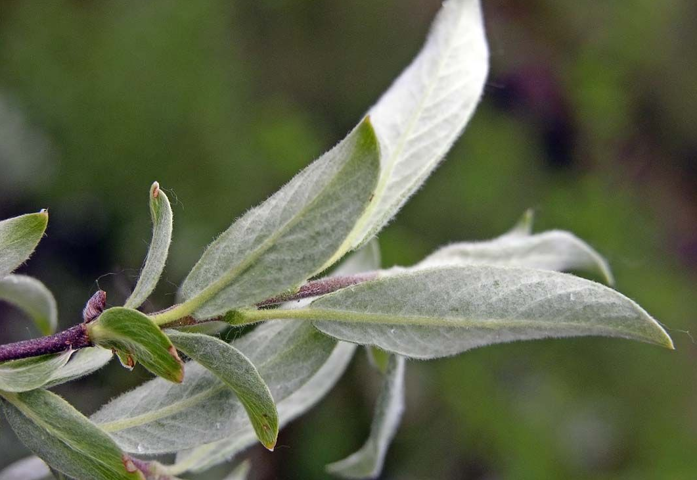

::: {.column-page}

::: {.grid}

::: {.g-col-7}
## Flying drones and capturing lidar data 
Section about drone technology here, in relation to willow density mapping.
Here is [the report](finse-willow-report.qmd). 
:::

::: {.g-col-5}

:::
 
::: {.g-col-5}

:::

::: {.g-col-7}
## Willow identification and mapping
Manually identifying the species and gender of willow bushes in the field can be challenging. Here is a [field guide](willow-identification.qmd) to help distinguish between the two target species and genders.
:::

::: {.g-col-7}
## Picture gallery
Check out all the [pictures](gallery.qmd) from the field. Shots from both bush- and birds-eyes view!
:::

::: {.g-col-5}
 for more.](media/team_station.JPG)
:::

::: {.g-col-5}

:::

::: {.g-col-7}
## The team
Here you can find [some information](about.qmd) about the team, and how to get in touch.
:::

:::
 
:::

