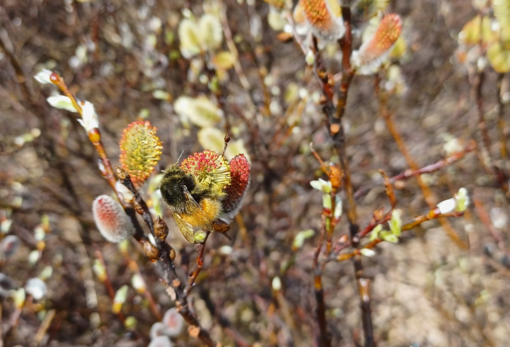
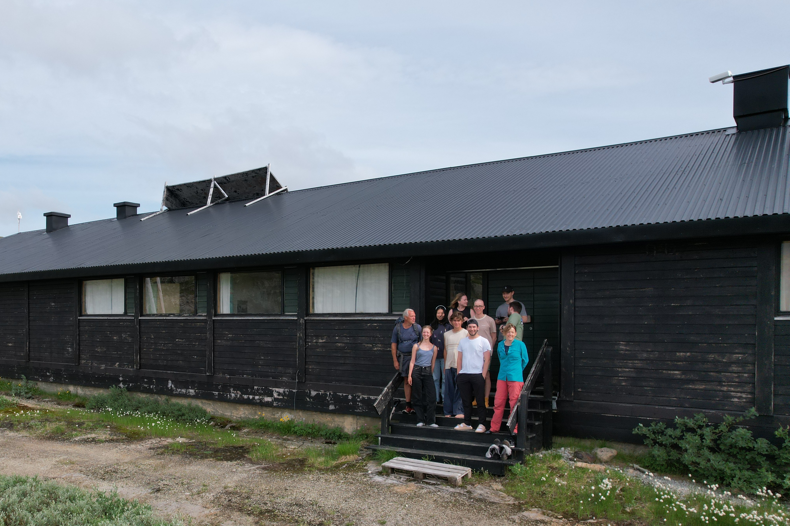

::: {.column-page}

::: {.grid}

::: {.g-col-7}
## Flying drones and capturing lidar data 
The Wingtra drone is used to capture imaging data and then a machine learning method is used to predict willow location.
Here is [a report summary](finse-willow-report.qmd). 
:::

::: {.g-col-5}

:::
 
::: {.g-col-5}

:::

::: {.g-col-7}
## Willow identification and mapping
Manually identifying the species and gender of willow bushes in the field can be challenging. Here is a [field guide](willow-identification.qmd) to help distinguish between the two target species and genders.
:::

:::

::: {.g-col-5}
## Bumblebee
And here a happy bumblebee in whom we are very interested to understand its relationship with willow distribution and flowering 
:::

::: {.g-col-3}

:::

::: {.g-col-7}
## Picture gallery
Check out all the [pictures](gallery.qmd) from the field. Shots from both bush- and birds-eyes view!
:::

::: {.g-col-5}

::: {.g-col-7}
## The team
Here you can find [some information](about.qmd) about the team, and how to get in touch.
:::

::: {.g-col-5}

:::

:::
 

